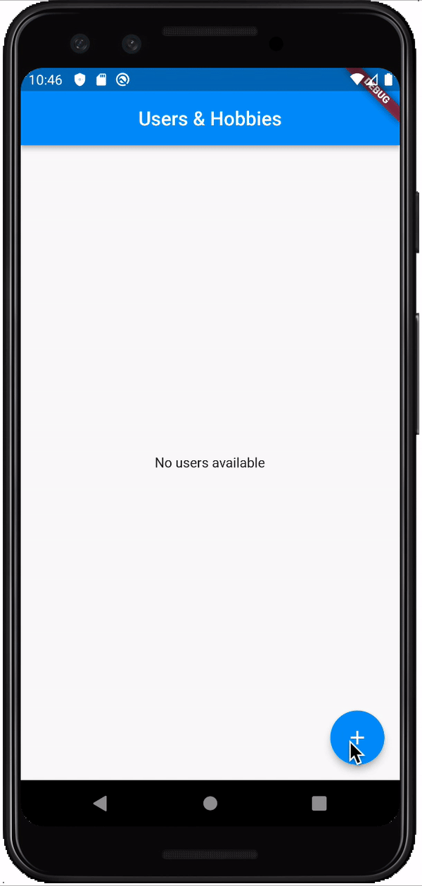

# Get Started with GraphQL

## Backend

The backed was built using Express JS, Graphql and Mongoose.

To run the project locally follow the next steps:

1. Download the project and add a file called `nodemon.json` with the next structure:

```
{
    "env":{
        "mongoDatabase":"...",
        "mongoUserName":"...",
        "mongoUserPassword":"..."
    }
}
```

2. Go to [Mongo DB](https://cloud.mongodb.com/), create a new project and add a database.

3. Setup the connection and update the credentials in the `nodemon.json` file.

4. run the next command in the GraphQL_BE folder:

```
$ nodemon start
```


5. As we are using [Lodash](https://www.npmjs.com/package/lodash) for the playground. Go to `http://localhost:4000/graphql` to start adding some data.

You can execute mutations and quaries inside the app, this is an example to create a user:

```
mutation{
  CreateUser(name: "Stan Lee", age: 75, profession: "Designer"){
    id
  }
}
```

and this is an example to query all the users:

```
query{
  users{
    id
    name
    posts {
      id
      comment
    }
    hobbies {
      id
    }
  }
}
```

You can check for more mutations in other objects in the Lodash documentation provided in the right panel of the app.

Also the app is published in Heroku in the next url: [https://graphql-flutter-course-coe.herokuapp.com/graphql](https://graphql-flutter-course-coe.herokuapp.com/graphql)

## Client App

The client app was build using Flutter and the package `graphql_flutter`

